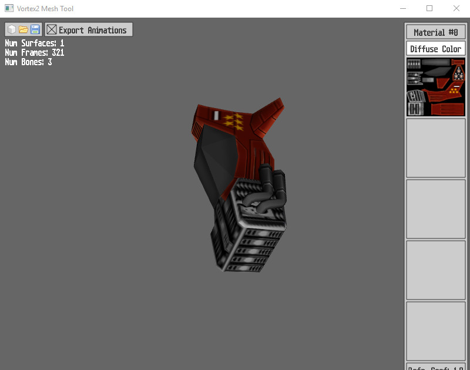

## Introduction
Vortex is an open-source, lightweight 3D graphics rendering library which is easy to use and easy to integrate with any application that requires graphics. It can also be used as the base for a higher level graphics or game engine.

It has been released under the terms of the [**MIT license**](https://en.wikipedia.org/wiki/MIT_License), which allows its use within both open and closed source software. This license allows to use the library in commercial applications.

## Features
* A clean, simple object oriented API programmed in the [**Monkey-X**](http://www.monkey-x.com) language.
* Works on all Monkey targets that support OpenGL ES 2: **Windows**, **macOS**, **Linux**, **Android**, **iOS** and **HTML5**.
* Graphics architecture based on modern **OpenGL ES 2.0**. It makes use of shaders and vertex buffer objects.
* Supports 2D (primitives, images, text) and 3D rendering.
* Loads textures in the most common formats: JPG, PNG, BMP...
* Includes tool to convert **TrueType** (ttf) fonts into bitmap based fonts.
* Meshes can be created in code or loaded from a custom XML based format (includes tool which uses the [**Irrlicht**](http://irrlicht.sourceforge.net) engine to import meshes, with support for several popular formats).
* **Materials** support diffuse color, diffuse texture, lightmap, normal map, reflection and refraction cube maps, opacity, and specular reflections. They also support different blending modes: alpha, additive, multiplicative.
* **Dynamic lighting** with directional and point lights (configurable number of lights).
* **Skeletal animation** for meshes.
* **Linear fog** for ambient effects.

## Installation
You should clone the repository onto **<*MonkeyFolder*>/modules_ext/vortex**, or download as a zip file and put the vortex folder on that same **<*MonkeyFolder*>/modules_ext** location. You should select **Help -> Rebuild Help** on the MonkeyX IDE (Ted) afterwards, and the documentation will be available in your modules help.

## Acknowledgments
* Jon Pittock (skn3) for his XML library (licensed under the MIT license).
* The Irrlicht team for the engine used on the mesh tool (Irrlicht is licensed under the Zlib license).
* Sean T. Barret for his stb_truetype and stb_image_write libraries, used on the font tool (these libraries are public domain).

